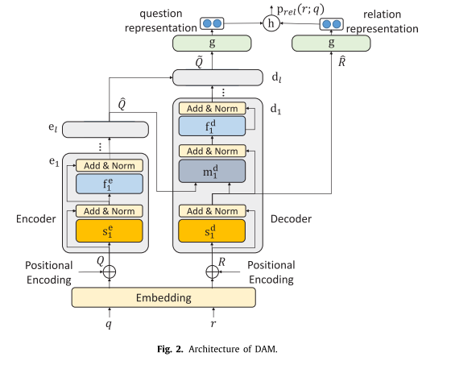

# DAM Transformer-based relation detection for Question Answering over Knowledge Base

Why？

How？

## 

KBQA，针对关系检测的文章

提出一个基于Transformer的语义匹配模型（DAM）。

构建了三阶段的KBQA管道模型，

## limitations

为了减少不可见关系的数量，很多研究将关系名分解为词序列，place_of_birth分解为place,of,birth。

论文认为：

- 这样做会使得关系长度很长，过长的关系长度限制了现有注意力机制的表现
  - 像Freebase的知识库，其中的关系包括两部分（eg：people.person.place_of_birth），subject的类型和真实的关系名称。但是前缀也不能忽略，有关系名称相同而前缀不同的关系。
  - 为了回答复杂问题，知识库需要2-hop关系链作为核心关系。
- 一个关系的单词与问题的不同部分相关，对关系中的每个单词，将相同的注意力分布应用于问题是不合理的（注意力机制通过关系的全局向量表示计算注意力权重）。

## 详细实现

### 序列匹配模型baseline

relation：$R=[r_1,r_2,...,r_n]$

question：$Q=[q_1, q_2, ..., q_m]$

关系和问题的匹配分数：$P_{rel}(r;q)=h(g(f(R)), h(f(Q)))$

$f: \mathbb{R}^{n\times d\rightarrow \mathbb{R}^{n\times d}}$ ： 一个将词向量转换为 `d` 维语义向量的神经网络，比如BiLSTM。

$g: \mathbb{R}^{n\times d}\rightarrow \mathbb{R}^d$：表示聚合操作函数。

## 实验部分可借鉴的部分

## 看着觉得舒服的句子？

Relation Detection is a core component of Knowledge Base Question Answering (KBQA)